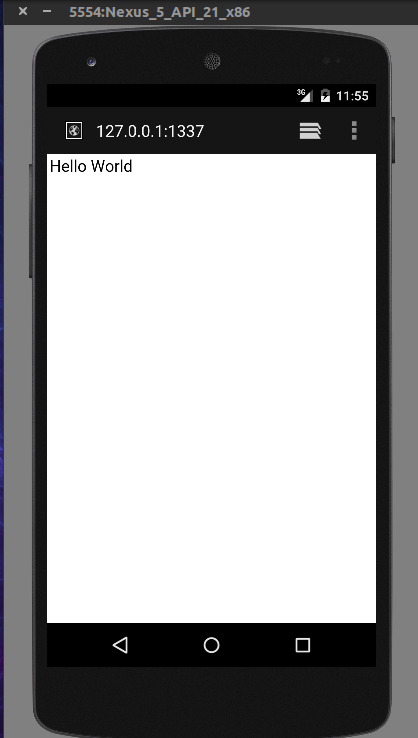
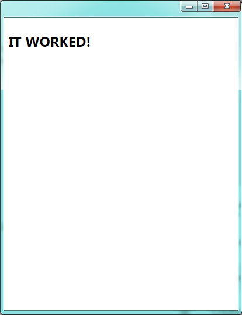
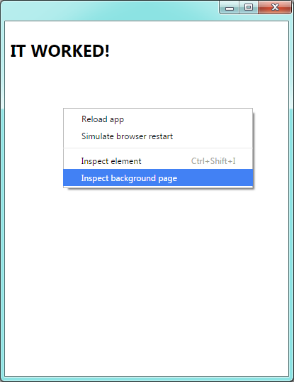
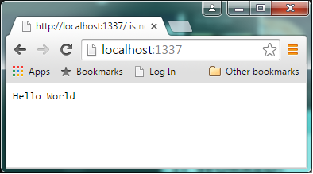
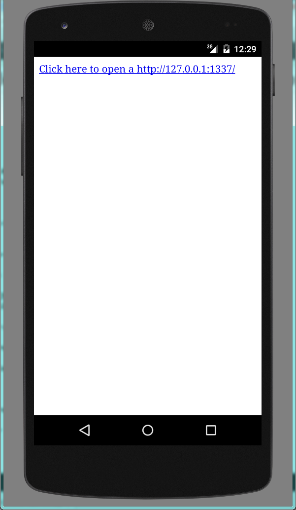

**Time: 30 minutes max if you already have a mobile development environment installed**

### Introduction 
This is the first in a series of tutorials/blog posts about using [chromiumify](https://github.com/chromiumify/chromiumify) to create mobile and desktop applications that share code using node.js constructs. 

The series will give novel examples of using [chromiumify](https://github.com/chromiumify/chromiumify) with a focus on adhoc/mesh/fog network implementations.

Before we get to that we will start by building the basic **hello world** server that is featured on the [node.js](https://nodejs.org) website and then running it on a mobile phone.

The final output will look like the image below but you should get a good idea of what [chromiumify](https://github.com/chromiumify/chromiumify) can offer. 
The source code is available [here](https://github.com/chromiumify/hello-world-proj)

**The only prerequisits are that you have a [node.js](node.js) runtime installed.** 

{<1>}

### Let's Go!!
To start lets install chromiumify
```
$ npm install chromiumify -g
```
Create a project folder 
```
$ mkdir hello-world-proj
$ cd hello-world-proj
```

Now create a folder for the chrome app. This will contain the build output for your project.
```
$ mkdir chrome-app
```

Then use chromiumify to generate a template project in the folder that you just created. 
```
$ chromiumify gen chrome-app
```

You should now be able to see the template project run
```
$ chromiumify run chrome-app
```

The above command should show this screen. 

{<2>}


Now you have the base application up and running lets enhance it to host a web server.

In the **hello-world-proj** folder install the Chrome App node.js libraries for **net**, **http**, **dgram** and **fs** using the init command.
```
$ chromiumify init
```

We now need to create a browserified version of **background.js** to run the HTTP server.
Create a new folder called **src** at the same level as the chrome-app folder.

**i.e. hello-world-proj/src**

In that folder create a file called background.js and add the following code to it.

```
chrome.app.runtime.onLaunched.addListener(function () {
  chrome.app.window.create('index.html', { 
    'bounds': {
      'width': 400,
      'height': 500
    }
  })
})

var http = require('http');
http.createServer(function (req, res) {
  res.writeHead(200, {'Content-Type': 'text/plain'});
  res.end('Hello World\n');
}).listen(1337, '127.0.0.1');
console.log('Server running at http://127.0.0.1:1337/');
```

The **addListener** event is used to show the main HTML page and the code below that is the simple http server mentioned in the introduction. 

Now we need to package this code to use in our application as follows. 

```
$ chromiumify src/background.js -o chrome-app/background.js
```

Now rerun the application

```
$ chromiumify run chrome-app
```

And on the screen that is displayed right click and select **Inspect Background Page**
{<3>}

In the console you will see the output. 

**Server running at http://127.0.0.1:1337/**

And you should be able to open up that location in a normal browser

{<4>}

### Well Done!! - You are now running node in a Chrome App

Before we deploy this to the mobile device lets change the HTML in the app to make the sample easier to use. 

Open the HTML file at chrome-app/index.html and replace the content with the following

```
<!DOCTYPE html>
<html>
<head>
</head>
<body>
  <a href="http://127.0.0.1:1337/" target="_blank">Click here to open http://127.0.0.1:1337/</a>
</body>
</html>
```
Now rerun the application again

```
$ chromiumify run chrome-app
```
and clicking on the link in the app should open a browser window. 

### Run it on mobile

Now install the Google [Mobile Chrome App for your desired environment](https://github.com/MobileChromeApps/mobile-chrome-apps/blob/master/docs/Installation.md)

Once that is installed run 
```
$ cca create chrome-android --link-to=chrome-app
$ cd chrome-android
$ cca run android --emulator
```
or for iOS 
```
$ cca create chrome-ios --link-to=chrome-app
$ cd chrome-ios
$ cca run ios --emulator
```

You should now see our app launched 

{<5>}

And clicking on the link pops a the browser window we showed at the start of the tutorial. 
{<6>}

### Summary 

Now that we can run node.js services from mobile devices the next tutorial will investigate how  we can potientially discover these services in a local network scenario. 

### Feedback 

Please raise any comments or questions on this blog post in the [issues section of the source repository](https://github.com/chromiumify/hello-world-proj/issues) 

