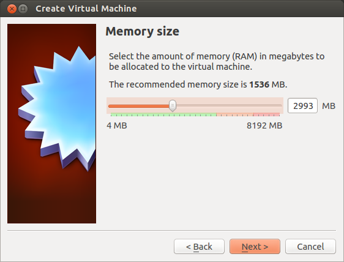
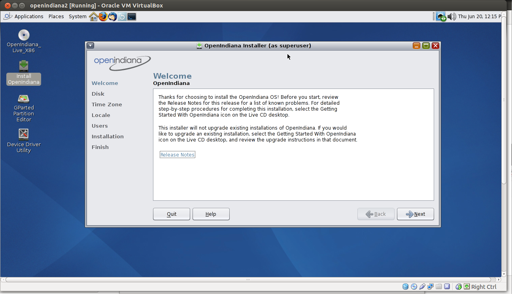
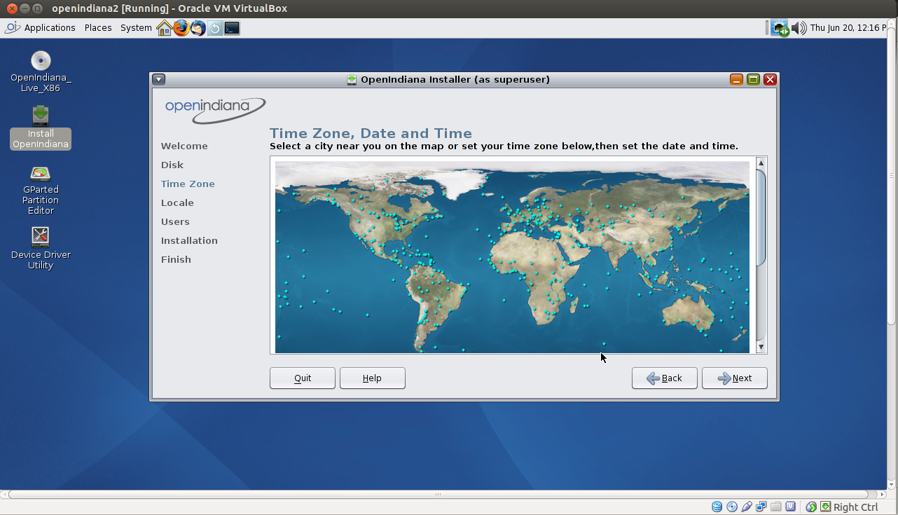

**Update**
If you are using OI hipster most of these steps won't apply but some of the unmangling and compile options may be useful.
## Introduction

When node.js is ran on IllumOS based kernals it has the additional benifit of DTrace. The default operating system normally choosen is [SmartOS](http://smartos.org/) from [Joyent](http://www.joyent.com/) but there are alternatives.

While SmartOS is fantastic for production, the development experience is not great when compared to other desktop operating systems such as Mac and Linux (even Windows for that matter) the lack of a window manager can be an impedance. 

It should be stated that the lack of window manager is good for SmartOS as this means less baggage in the production environment but the disconnect between development OS and production OS can lead to some nasty side effects : 

1. Deployment - Especially if those projects have native components
2. Platform - Developers not understanding the full potential of the OS can lead to bad design decisions
3. Testing - Greater potential for tests to fail during integration test leads to increased development time. 

So I have been using [Openindiana](http://openindiana.org/) in my development workflow to ensure I am as close to the deployment environment as we possible while having a sane development experience.  

[Openindiana](http://openindiana.org/) is an [IllumOS](http://wiki.illumos.org/display/illumos/illumos+Home) based operating system with a Gnome 2.6 GUI.

OpenIndiana is one of the most understated operating systems out there as it gives access to the power of IllumOS tools such as DTrace and ZFS but within a sane desktop environment for additional development productivity. 

When you finish this article you will be able to develop node.js applications on a desktop operating system which is closer to a SmartOS environment than any other desktop operating system out there today.

So with no more ado on with the tutorial. 

## Install VirtualBox on Ubuntu

I personally run OpenIndiana on the bare metal of my office machine but as you may just want to put a toe in the water tot start I am giving step by step Virtual Box instructions. 

Ubuntu is not a prerequisite as any operating system that supports Virtualbox can be used but as installing virtualbox was a little trickier than expected on Ubuntu it is have included it here.

OpenIndiana can of course be install onto a physical machine and if that is the preferred option then create a bootable media (CD/USB) from the [ISO](http://openindiana.org/download/) provided and join this tutorial at step 10 below.

It should also be noted that VirtualBox is not a prerequisite either but if you have no VM experience/preference then this should help you get up and running quickly

To install on a virtual machine on ububtu 

1. In the BIOS enable KVM support (This is turned of by default on the machines I have used)

2. Install the ubuntu prereqs that enables the additional module build step at the end of the virtualbox install.

```
sudo apt-get install build-essential linux-headers-`uname -r` 
sudo apt-get install linux-kernel-*
sudo apt-get install linux-source
sudo apt-get install virtualbox 
```
 
## Install OpenIndiana

1. Download the latest iso for OpenIndiana [http://openindiana.org/download/](http://openindiana.org/download/). 
The [OpenIndiana Build 151a7 Desktop DVD (32/64-bit x86), 811M](http://dlc.openindiana.org/isos/151a7/oi-dev-151a7-live-x86.iso) was used for the steps that follow.   

2. Run VirtualBox and create a new image you should be presented with the following screen: 
 

3. Set your memory size ( I am using around 3Gb) 
 

4. Create a virtual Hard drive
 

5. Take the default hard drive file type 
 

6. Storage on physical device is set to fixed size
 

7. Select location and size of the device. There was issues with the default here so make sure to give it plenty of space. 
 

8. You are now ready to start
 

9. When you select start you will be prompted for an ISO. Use the one you downloaded in step 1. 
 

10. Select the first option in the boot up screen. 
 

11. Select the Keyboard. 
 


12. Select a language. 
 

13. You will now be presented with a desktop. 
 

14. As you are in effect running a live CD you now need to install the OS onto your virtual hard drive so click the "Install OpenIndiana" desktop item.  
 

15. Use the whole disk.  
 

16. Select the correct time zone.  
 

17. Select the prefered locale.  
 

18. Create root password and add a user. It is strongly recommended that your create a user along with root.  
 

19. Review and Click Install  
 

20. When the machine reboots do make sure that you select "Boot from Hard Disk" instead of the default option used in Step 10.

*You now have a running OpenIndiana System*

## Post OS Install 

Now the operating system is installed and you have logged in as the user create in step 18 we need to configure it to build node.js. 

The following steps are executed at the command prompt as the logged in user unless stated. 

### Upgrade package manager

```
sudo pkg install pkg:/package/pkg
```
### Add the Spec Files Extra Repository

```
pkg set-publisher -p http://pkg.openindiana.org/sfe
```
### Update OS to latest release 

```
sudo pkg image-update --be-name [NAMEOFIMAGE] -v
```
### Run packagemanager and install development dependencies 

```
sudo packagemanager --allow-links
```

### Select the following packages in the package manager

```
Publisher   : openIndiana.org 
Category    : Development
SubCategory : Source Code Management 
Package     : git

Publisher   : openIndiana.org 
Category    : Development
SubCategory : C
Package     : developer/library/lint

Publisher   : openIndiana.org 
Category    : System
SubCategory : Libraries
Package     : header-math

Publisher   : openIndiana.org 
Category    : System
SubCategory : Core
Package     : system/header

Currently gcc is not appearing in the package manager. 
Select Publisher : sfe 
Search for gcc
Select sfe/developer/gcc
```

### Update .profile

The node build environment expects cc and CC to be defined or the build will fail

```
export cc=/usr/gcc/4.6/bin/gcc
export CC=/usr/gcc/4.6/bin/gcc
```
Then refresh profile

```
$ source .profile
```

### Checkout and build Node.js 
```
$ mkdir github
$ cd github
$ git clone git://github.com/joyent/node.git
$ cd node
//Replace version with the appropriate one
$ git checkout v0.10.8
```
Only use --dest-cpu=x64 if you have a x64 architecture. 
The command ``` isainfo -k ``` will return ``` amd64 ``` if you do. 
```
$ ./configure --with-dtrace --dest-cpu=x64
$ make
//At the moment I am recommending that the build is not 
//installed to allow for multiple environs and easier upgrades.
```
### Open profile configuration
```
$ vi ~/.profile
```
### Update PATH in editor with root of Node install 
PATH=/path/to/node/root:$PATH
### Set source
```
$ source ~/.profile
$ node -v
v0.10.8
```

### Checkout and build NPM
```ls
$ curl -k https://npmjs.org/install.sh > install.sh 
$ chmod +x install.sh 
$ ./install.sh 
```
### Open profile configuration
```
$ vi ~/.profile
```
### Update PATH with root of NPM install 
PATH=/path/to/npm/root:$PATH
Should be /home/USERID/github/bin

### Set source
```
$ source ~/.profile
$ npm -v
v1.2.23
```
### Install node.d for DTrace Support

There is a support file in the src folder of the node git checkout that needs copying to the dtrace folder so dtrace can observe node.js. 

```
$ cd /path/to/node/src
$ sudo cp node.d /usr/lib/dtrace
``` 

### Extras 

The default firefox is version 3.6 you may want to download a later version from [unixpackages](http://www.unixpackages.com/packages/mozilla). 

Open Solaris version 21 was downloaded as a tarball and works well. 

You probably also want to configure git on the environment 
For initial configuration see [https://help.github.com/articles/set-up-git](https://help.github.com/articles/set-up-git)
For ssh configuration see [https://help.github.com/articles/generating-ssh-keys](https://help.github.com/articles/generating-ssh-keys)

Now that you are fully setup you should be able to run through the [famous flamegraph article](http://blog.nodejs.org/2012/04/25/profiling-node-js/).

 

Until next time. Code On! 